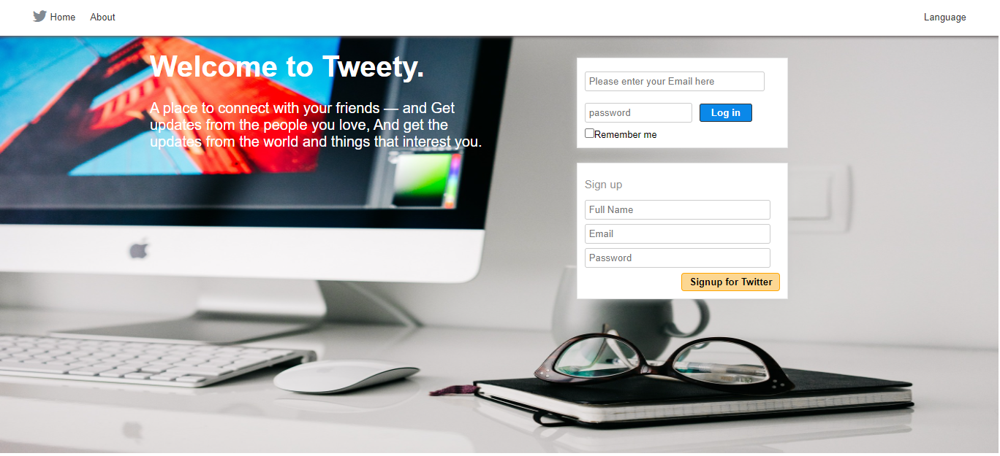
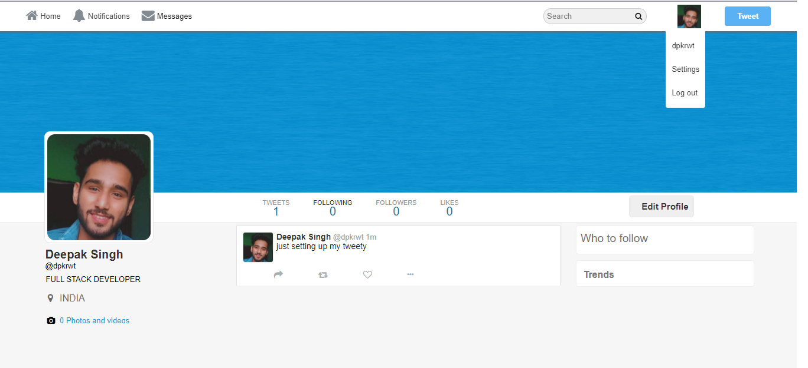
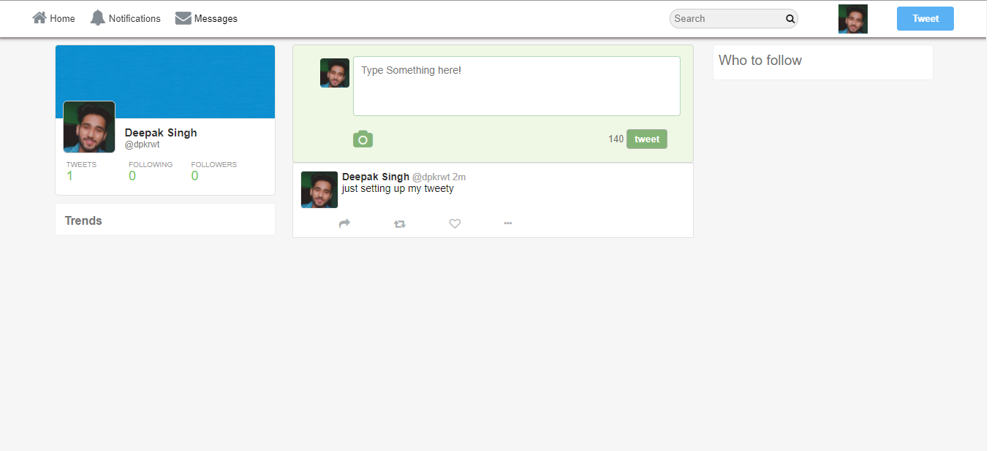
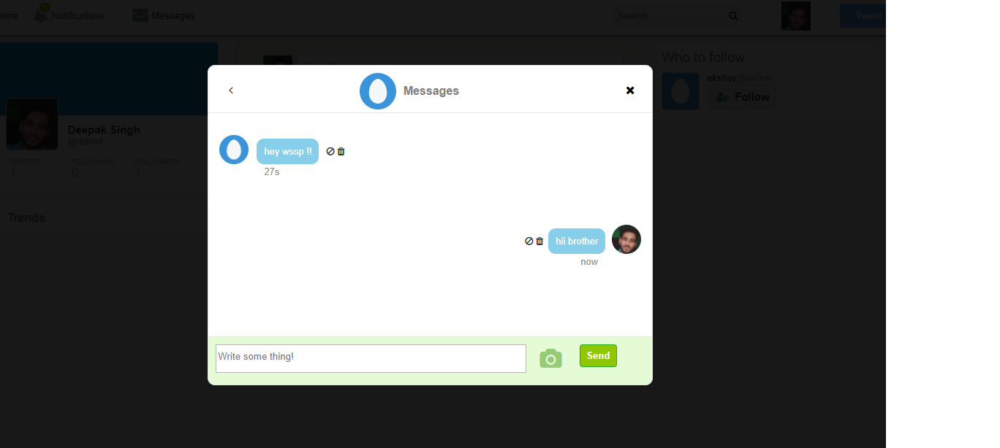

## **Hey there **
Hi, I'm [DEEPAK SINGH RAWAT](https://deepakrawat.vercel.app/), a self-taught Full Stack web developer and a freelance software engineer from _uttarakhand India_ . My passion for tech is inventing new ideas and bringing them to life through beautiful user interfaces. I put a lot of thought into the user interface, design, and code quality of the products I create.
I am also an open-source enthusiast and maintainer. I learned a lot from the open-source community, and I love how it facilitates collaboration and information sharing.

  

# LOGIN PAGE

# PROFILE PAGE

# HOME PAGE

# MESSAGE PAGE

### _dear friends hope you doing great, if you need my any help i'll be there. You can contact me on Instagram or direct MAIL me:_

 
 
 
 

## If you want a whole file including .SQL then its paid !!

  

Make sure to add your mysql user,db pass in connection.php file, and if you are not using localhost then replace the domain path from init.php and all ajax files with your domain name. And in your tweet class, look for getTweetLinks method and it's urls to your domain url.

## __Thank you -- Your teacher Deepak__
